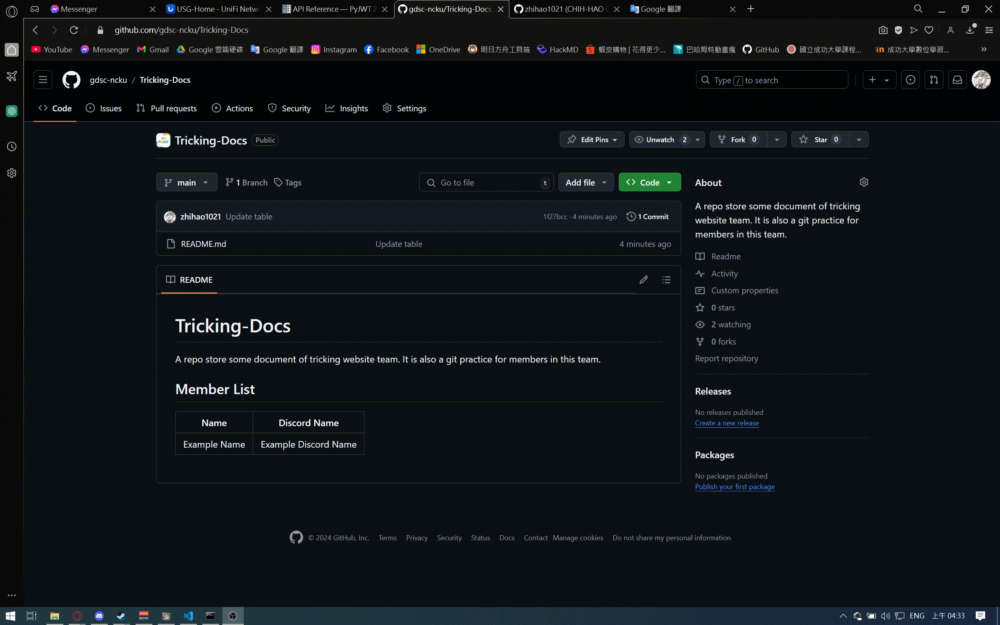
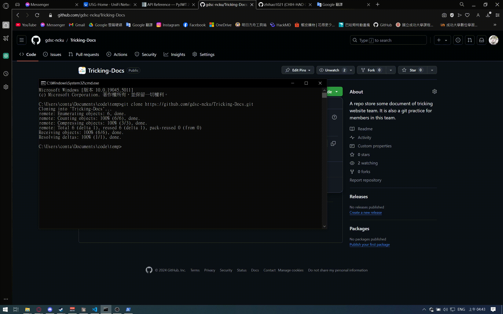
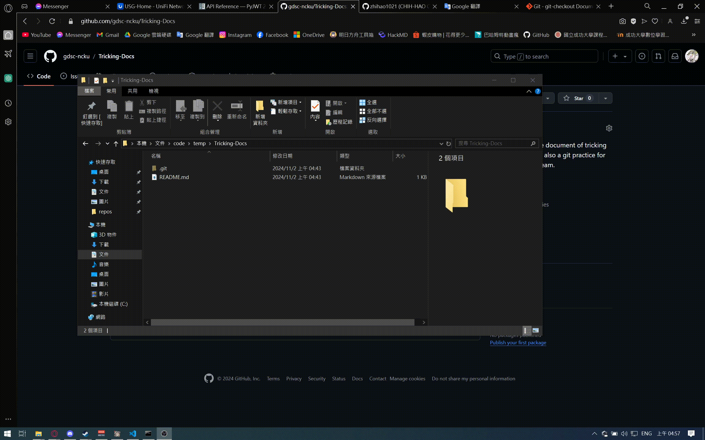
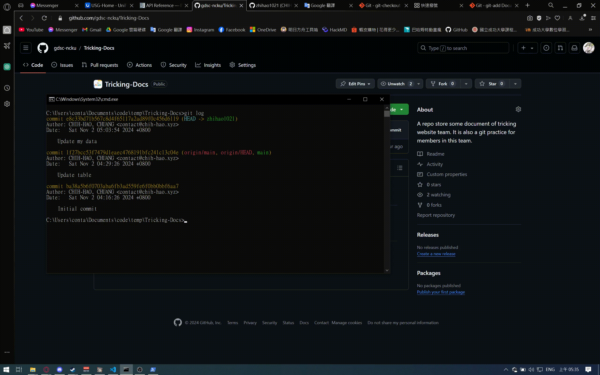
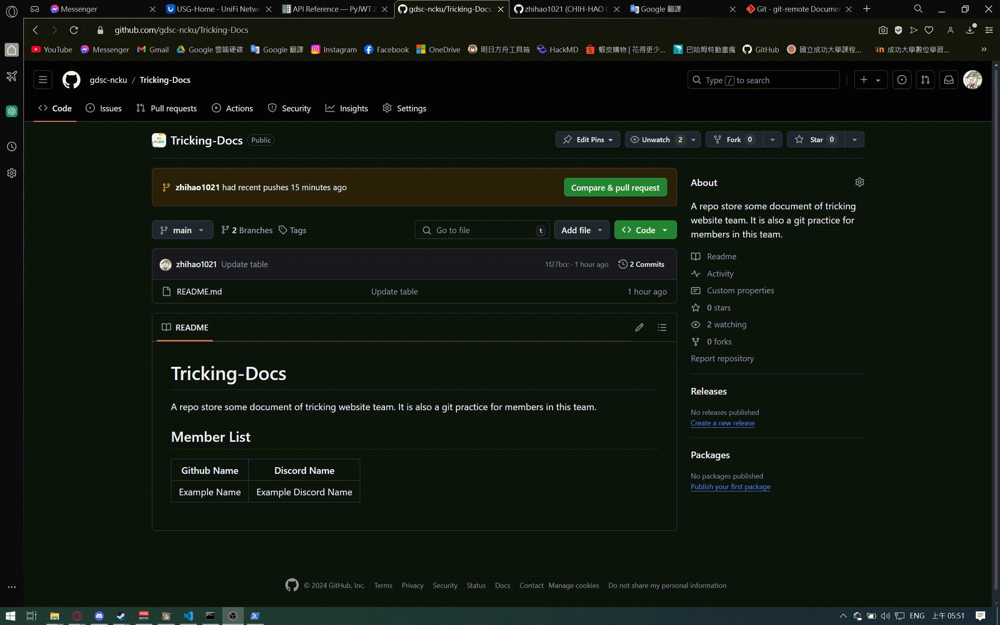

# Tricking-Docs
A repository store some document of tricking website team. It is also a git practice for members in this team.


## Member List
| Github Name | Discord Name |
| :---------: | :----------: |
| Example Name | Example Discord Name |
| zhihao1021 | YEE |
| mario3443 | OF_Mario |
| swenbao | swenbao |
| ouo314 | ouo314 |
| New9c | ericgwhuang |

## Practice - Git
### Target
Add your github username and discord name on the above table.


### Steps
### 0. Before start
You need to install and setup git on your computer first.


### 1. Clone the repo
Copy the URL of this repository from the button on top-right side in this page and clone it in your terminal.
```bash
# Replace <repository URL> by the URL of this repo.
git clone <repository URL>
```



### 2. Create new branch
Get into the directory that you cloned in previous part.
```bash
cd Tricking-Docs
```
Create a new branch by the following command:
```bash
# Replace <branch name> with your own custom name.
git checkout -b <branch name>
```
> The `checkout` command use for changing branch, the argument `-b <branch name>` mean that create a new branch with `<branch name>` and switch to it.

Make sure you are in the right branch.
```bash
git branch
# It should look like this:

# ~/Tricking-Docs$ git branch
#  main
# *<name you set>
```



### 3. Edit README.md
Open `README.md` in the directory of this repository by your own text editor and append your github name and discord name to the [table](#member-list).

Don't forget to save the file after you change it.



### 4. Commit the change
Back to the terminal and check current status.
```bash
# This command would show you which files are changed.
git status
```
You will see a line displaying `modified: README.md` with **red** color, it mean this file has not been added to the index, simply to say, this file would not be included in the next commit.

Now, add the file into index and check the status again:
```bash
git add README.md
git status
```
After you execute `add`, you will see the line turn into green from red, which means the file has been added into index and will also be included in your next commit.

Finally, commit the change.
```bash
# Change <commit message> by your own.
git commit -m "<commit message>"
```

After committing the change, you can check the logs. You will see that the latest commit is the one you just submitted.
```bash
git log
```


### 5. Push to GitHub
With the previous steps, you have finished the work on your computer. Next, you will need to sync the changes to the remote.
```bash
# Replace <branch name> with your branch name.
git push origin <branch name>
```
The meaning of This command is to push current branch of local repository to the `<branch name>` branch in `origin`. The word `origin` is the name of the remote repo, you can check the URLs of all remote repositories by using `git remote -v`. It can be different between local branch name and remote branch name, but it is recommended to keep them same for easier management.



### 6. Create a pull request
After you push your changes to the remote repository, you will need to create a pull request to merge changes into main branch.

Go back to the browser and select your branch from the dropdown menu at top-left of the page. (You may need to reload the page to refresh the branches list.)

Next, you will see a contribute menu appear below the code button. Open it and click the "Open pull request" button to go to the pull request page.

Finally, click the "Create pull request" button on button and you have completed this practice.

